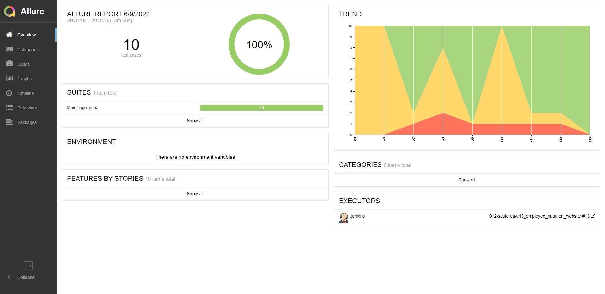

# Тестирование UI сайта компании Naumen
[](https://www.naumen.ru/)

### В проекте использованы :gear:

### В проекте протестировано :mag_right:
* переход на главную страницу при клике по логотипу в хедере;
* структура меню хедера;
* переходы по пунктам меню хедера;
* ховер при наведении курсора на меню.
## Для запуска тестов
### локально в терминале :computer:
```
gradle clean test
```
### удаленно в Jenkins :desktop_computer:
```
gradle clean test
-Dbrowser=${BROWSER}
-DbrowserSize=${BROWSER_SIZE}
-DbaseUrl="${BASE_URL}"
-Dremote="${REMOTE}"
```
[Пример сборки](https://jenkins.autotests.cloud/job/012-sesterca-u13_employee_naumen_website/13/)
Открыть [Jenkins](https://jenkins.autotests.cloud/job/012-sesterca-u13_employee_naumen_website), в меню слева выбрать ```Собрать с параметрами```
#### Параметры сборки
<details><summary>BROWSER</summary><p>Браузер, в котором будут выполняться тесты (по умолчанию <strong>Chrome</strong>)</p></details> 
<details><summary>BROWSER_SIZE</summary><p>Размер окна браузера (по умолчанию <strong>1920х1080</strong>)</p></details>
<details><summary>BASE_URL</summary><p>Адрес тестового окружения (по умолчанию <strong>https://www.naumen.ru/</strong>)</p></details>
<details><summary>REMOTE</summary><p>Адрес удаленного сервера, на котором будут запускаться тесты (по умолчанию <strong>selenoid.autotests.cloud</strong>)</p></details>

## Для просмотра отчета
Под названием проекта кликнуть [](https://jenkins.autotests.cloud/job/012-sesterca-u13_employee_naumen_website/allure/)

